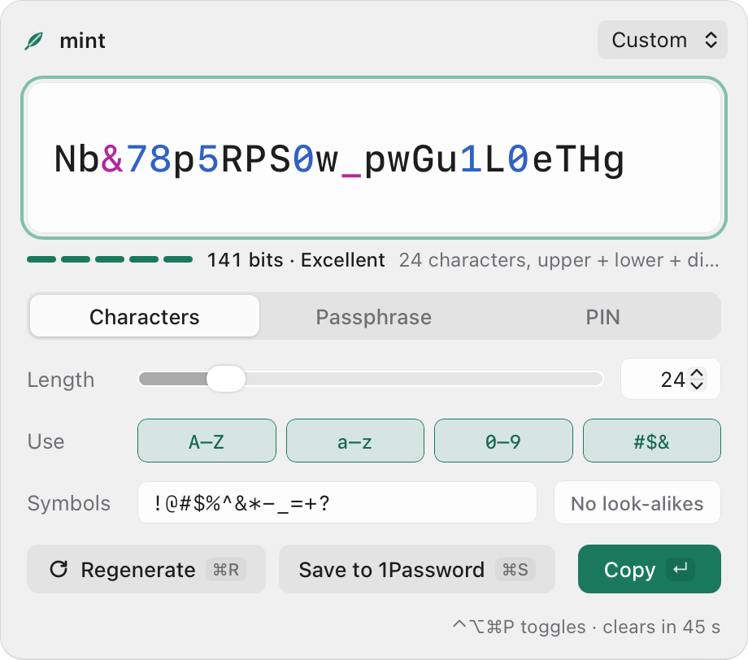
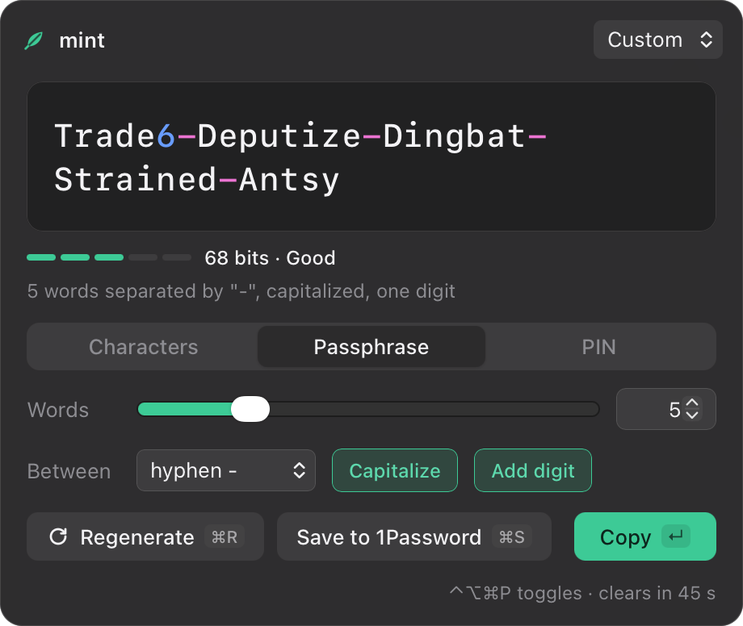

# mint

A password generator with one engine and several ways in: a command line, a small window, a global hotkey and menu bar icon on macOS, and an Omarchy bar widget on Linux (the `omarchy-mint` plugin). Passwords save straight into 1Password.

<p align="center">
  
  
</p>

## Install

### macOS

Requires stable Rust, Node (for the Tauri CLI) and Xcode command line tools.

```sh
scripts/install-macos.sh            # launch at login on
scripts/install-macos.sh --no-login
```

- `/Applications/mint.app`: menu bar icon, window and global hotkey (⌃⌥⌘P)
- `~/.local/bin/mint`: a link to the CLI inside the app (`MINT_BIN_DIR` changes the directory)
- Ad hoc signed, for the machine that built it

### Linux

- `packaging/arch/PKGBUILD` builds `mint` and `mint-app` and installs a desktop file (`makepkg -si` in that directory)
- Wayland has no global hotkeys for apps: a compositor bind runs `mint gui --toggle`, e.g. Hyprland `bind = SUPER SHIFT, P, exec, mint gui --toggle`; if focus is refused, the bind hides the window again
- Clipboard: `wl-clipboard` 2.3 or later (for `--sensitive`)

### Windows

- CI builds `mint.exe` and `mint-app.exe` as an artifact; untested on a real machine

### CLI only

```sh
cargo install --path crates/mint-cli
```

## Command line

```sh
mint                          # 24 characters, all four classes
mint 32                       # length 32
mint 10-16 --require 3        # a site's "10 to 16, 3 of 4 types": uses 16
mint --preset moneris         # the same rule by name
mint --no-symbols 20          # letters and digits
mint --symbols '!#$' 16       # only the symbols a site accepts
mint --no-ambiguous           # no 0 O o 1 l I |
mint --words 5 --capitalize --digit
mint --pin 6
mint --count 5                # five, one per line
mint copy                     # reads the secret from stdin; never a command argument
mint --copy                   # to the clipboard, hidden from history, cleared after 45 s
mint --json                   # {"password", "length", "kind", "classes", "entropy_bits", "rule"}
mint save --title "Moneris" --url https://moneris.com --username me --preset moneris
mint save --item "Moneris" 16 # replace an existing item's password
mint gui --toggle             # show or hide the window
mint presets
```

- `mint copy` accepts 1–16384 UTF-8 bytes on stdin, preserves whitespace, rejects NUL, and never echoes the secret. `--json` returns `copied` and `clears_after`; `--clear-after` and `--no-clear` use the shared clipboard policy.
- Plain output by default; `--json` for scripts; no prompts
- `mint save` prints the item ID and a 1Password link, not the password (`--show` adds it)
- The JSON contract, field by field: [SPEC.md](SPEC.md#json-contract)

| Exit code | Meaning |
|---|---|
| 0 | Success |
| 2 | Usage error |
| 3 | The rule cannot be satisfied |
| 4 | 1Password CLI missing, not signed in, or failed |
| 5 | Clipboard failed |

## Window

| Key | Action |
|---|---|
| ⌃⌥⌘P | Show or hide (macOS; Ctrl+Shift+Alt+P on Windows) |
| Enter | Copy and hide |
| ⌘R / Ctrl+R | Regenerate |
| ⌘S / Ctrl+S | Save to 1Password (again to submit) |
| ⌘P / Ctrl+P | Presets |
| Esc | Close the save form, then hide |

- Opens focused, with a fresh password, centered on the screen under the pointer
- Digits and symbols are tinted; strength is shown in bits
- On macOS it is a non-activating panel, like Spotlight: it works over full-screen apps, and focus returns to the previous app when it hides
- Menu bar: Generate, Copy New Password, Open Window, Copy From Preset, Launch at Login, Quit

## Presets

| Name | Rule |
|---|---|
| `moneris` | 10 to 16 characters (uses 16), all four classes, at least 3 |
| `alnum` | 24 letters and digits |
| `wifi` | 63 characters, no ambiguous characters |
| `words` | 5 words, capitalized, one digit |
| `pin4`, `pin6` | 4 or 6 digits |

User presets live in `~/.config/mint/presets.toml` (`%APPDATA%\mint\presets.toml` on Windows), one table per site; a user preset replaces a built-in of the same name.

```toml
[bank]
description = "Bank website"
length = "8-12"
classes = ["upper", "lower", "digits"]
require = 3

[router]
length = 32
symbols = "!@#"
no_ambiguous = true

[memorable]
words = 6
separator = "."
capitalize = true
digit = true

[door]
pin = 8
```

## Settings

`~/.config/mint/config.toml` (`%APPDATA%\mint\config.toml` on Windows):

```toml
hotkey = "Ctrl+Alt+Cmd+P"   # global shortcut for the window
clear_after = 45            # seconds before a copied password is cleared; 0 = never
hide_on_blur = true         # hide the window when it loses focus
default_preset = "moneris"  # rule that bare `mint` and the window start from
theme = "system"            # window: system, light or dark
```

The app writes a log of startup, hotkey registration and login-item changes to `~/Library/Logs/mint.log` (macOS) or `~/.config/mint/mint.log`. It never logs passwords.

## Security model

**Randomness**
- Every byte comes from the operating system's CSPRNG through `getrandom`: `getentropy` on macOS, `getrandom(2)` on Linux, `ProcessPrng` on Windows. No userspace PRNG holds password material.
- Characters are chosen by rejection sampling against a power-of-two mask: no `%`, no bias. A test fails the build if the sampling code ever takes a remainder.
- Required classes: one character from each enabled class, the rest from all enabled classes, then a Fisher–Yates shuffle with the same source.
- Tests: chi-square at p = 1e-6 over the sampler, the generated characters and the shuffle; every class present in 100,000 generations.
- Entropy is a conservative lower bound: `sum(log2 |class|)` for the guaranteed characters plus `(length − classes) × log2 |pool|`; passphrases `words × log2 7776`; PINs `digits × log2 10`.

**Secrets**
- Passwords never appear in argv, logs or files. `op` receives them as an item JSON template on stdin (`op item create … -`, `op item edit ID` with piped JSON); `wl-copy` and the Linux clipboard clearer receive them on stdin.
- Buffers holding passwords are zeroed on drop (`zeroize`), and `Debug` output redacts them.
- `mint save --item` refuses items that hold a passkey: the 1Password CLI drops passkeys when it edits from JSON.

**Clipboard**
- macOS: `org.nspasteboard.ConcealedType` and `TransientType`, so clipboard managers skip the copy.
- Linux: `wl-copy --sensitive` (`x-kde-passwordManagerHint`). Sensitive-copy failures and non-Wayland sessions fail without an unhinted fallback. Quattro clipboard history honours the hint.
- Windows: `ExcludeClipboardContentFromMonitorProcessing`, `CanIncludeInClipboardHistory = 0`, `CanUploadToCloudClipboard = 0`.
- Cleared after 45 s only if nothing else has been copied since: macOS and Windows compare the clipboard change counter, without reading it; Linux compares the text.

**1Password**
- `op` is found through `MINT_OP`, then `PATH`, then `/opt/homebrew/bin`, `/usr/local/bin`, `/usr/bin`. Once `MINT_OP` is set, it is the only place mint looks.
- The first save from the app asks 1Password to approve `mint-app` for CLI access.

## Development

```sh
cargo test --workspace            # core and CLI
cargo run -p mint-app             # the window, debug build
MINT_DEMO=save cargo run -p mint-app   # debug only: fixed states for screenshots (main, save, words, pin, copy)
```

- `crates/mint-core`: generation, presets, clipboard, 1Password
- `crates/mint-cli`: the `mint` binary
- `crates/mint-app`: the Tauri window, menu bar and hotkey (`mint-app`)
- A debug build hands off to a running `mint.app` (single instance, same identifier); quit mint from the menu bar first
- Tests never reach the real 1Password account: CLI tests point `MINT_OP` at a missing path, and core unit tests refuse to run `op` unless `MINT_TEST_REAL_OP=1`

## Credits

- Passphrase words: the [EFF large wordlist](https://www.eff.org/dice) (CC BY 3.0 US), Electronic Frontier Foundation
- Built on [Tauri](https://tauri.app) and [tauri-nspanel](https://github.com/ahkohd/tauri-nspanel)

## License

MIT
